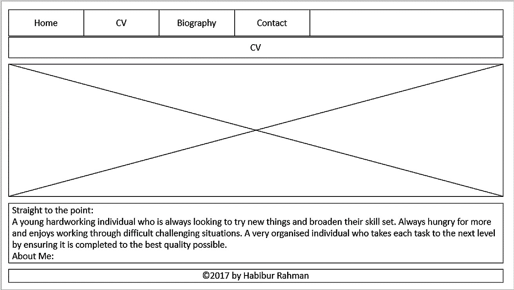
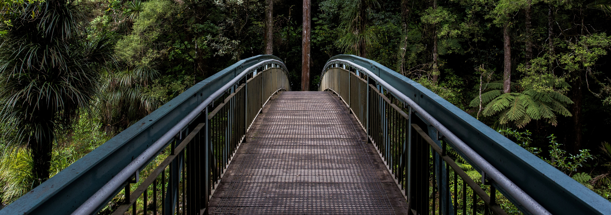
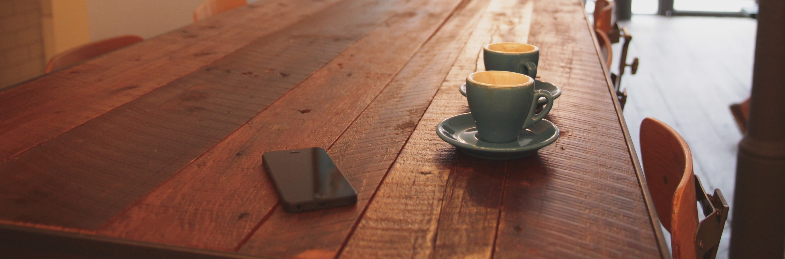

# csy1018-assign1
csy1018 Web Development Assignment 1

# Supporting Documentation
This is the supporting documentation for my E-Portfolio. Below I have included the research stages, the wireframes, the different prototypes, the progression of the site, the code used from other sources and the full code of my website.

# Research Stage
Before making my site, I needed to research similar E-Portfolios in order to get inspiration for my own. I took the good ideas and the positive aspects from other sites such as a consistent colour scheme and a professional image. Some aspects I wished to avoid were the outdated elements such as flashing text and moving banners as these are not the latest styles used in modern day websites.

One site I looked at was an e-Portfolio for 'Jessica Gilpin'. This can be found at http://jag0038.wixsite.com/jgilpin.
One of the aspects of this site that appealed to me was the layout of the site. This is as everything was structured and in a professional order. So I wanted to incorporate this within my own site.

Another site I looked at was an E-Portfolio for Patience Marsh. http://patiencelatta.wixsite.com/portfolio. On this site, one aspect I didn't like was the images as they were scattered around and made the site look messy and unprofessional. This is why in my own site, I wish to keep images neat and tidy and maintain an overall professional image.

# Wireframes
Below I have included the wireframes to each page of my site.

Home Page (Index):


CV Page:


Biography Page:


Contact Page:


# Prototypes
Before finalising my final product, I had a few prototypes along the way. I will show these below and state why I changed certain aspects of the site. Below is the first prototype of my E-Portfolio. One of the features I did not like about this prototype was that the navigation bar made the site look unprofessional and unfinished. However, an aspect I really liked was the colour scheme and how well it all went together.


Another prototype is shown below. The reason I did not like this was because the background colour for the text, made the site look tacky and unprofessional. This is why I changed this in my final version. On the other hand, the layout of all the elements were near perfect as it looked very professional and finished.


# Progression of Site


hours taken to complete
report etc
# Code Used from Other Sources
Within my site, I used other code from external sources. these are referenced below.

The code used for my form within the contact page was taken from an external website. This is shown below.
```
<form id="contact_form" action="#" method="POST" enctype="multipart/form-data">
  <div class="row">
    <label for="name">Your name:</label><br />
    <input id="name" class="input" name="name" type="text" value="" size="30" placeholder="Your Name:" /><br />
  </div>
  <div class="row">
    <label for="email">Your E-Mail:</label><br />
    <input id="email" class="input" name="email" type="text" value="" size="30" placeholder="Your E-Mail:" /><br />
  </div>
  <div class="row">
    <label for="message">Your message:</label><br />
    <textarea id="message" class="input" name="message" rows="7" cols="30" placeholder="Your Message Here:"></textarea><br />
  </div>
  <input id="submit_button" type="submit" value="Send email" />
</form>
```


# Web Development Project Code
Below I have included all of the pages in my assignment and all of the code within each page:

# style.css:
```
footer {
position:relative;
  font-family: 'Scope One', serif;
  color: grey;
  background: #700d84;
  text-align: center;
  padding: 8px;
  font-size: 1em;
  margin: 1px;
  max-width: 100%;
}

header {
position:relative;
  font-family: 'Scope One', serif;
  color: #b2641a;
  background: #fffff;
  text-align: center;
  padding: 8px;
  font-size: 3em;
  margin: 1px;
  max-width: 100%;
}

header1 {
position:relative;
  font-family: 'Scope One', serif;
  color: #b2641a;
  background: #fffff;
  text-align:inherit;
  padding: 8px;
  font-size: 2em;
  margin: 1px;
  max-width: 100%;
  text-decoration:underline;
}

header2 {
position:relative;
  font-family: 'Scope One', serif;
  color: #b2641a;
  background: #fffff;
  text-align:inherit;
  padding: 8px;
  font-size: 1.5em;
  margin: 1px;
  max-width: 100%;
  text-decoration:underline;
}

p {
position:relative;
  font-family: 'Scope One', serif;
  color: #700d84;
  background: #fffff;
  text-align: center;
  padding: 8px;
  font-size: 1.25em;
  margin: 1px;
  max-width: 100%;
}

img{
  width: 100%;
  height: auto;
  margin:0px;
}

ul.navigation li {
  float:left;
  text-align: left;
}

ul.navigation {
  list-style-type:none;
  margin: 0;
  padding: 0;
  overflow: hidden;
  background-color: #700d84;
  text-align: center;
}

ul.navigation li a:hover{
  background-color:grey;
}

ul.navigation li a {
  display: inline-block;
  color:white;
  text-align: center;
  padding: 5px;
  font-size:2em;
  font-family: 'Scope One', serif;
}

ul.grades li {
  font-family: 'Scope One', serif;
  color: #700d84;
  background: #fffff;
  text-align: left;
  padding: 8px;
  font-size: 1.25em;
  margin: 1px;
  max-width: 100%;
}

form {
  font-family: 'Scope One', serif;
  color: #b2641a;
  background: #fffff;
  text-align: center;
  padding: 8px;
  font-size: 2em;
  margin: 1px;
  max-width: 100%;
  text-decoration:underline;
}
```

# index.html
```
<!DOCTYPE html>
<html>
  <head>
    <meta charset="utf-8">
    <title>index.html</title>
    <link rel="stylesheet" href="css/style.css">
    <link href="https://fonts.googleapis.com/css?family=Arvo|Bitter|Copse|Cutive|Lora:700|Sanchez|Scope+One|Slabo+27px|Trocchi|Vesper+Libre" rel="stylesheet">
  </head>
  <ul class="navigation">
    <li><a href="index.html">Home</a></li>
    <li><a href="cv.html">CV</a></li>
    <li><a href="biography.html">Biography</a></li>
    <li><a href="contact.html">Contact</a></li>
  </ul>
  <header>
Habibur Rahman
   </header>
    
    <body>
      <header1>
        A little bit about me:
      </header1>
      <p>
        My name is Habibur Rahman. I am a student studying Computing at the University of Northampton. I am 18 years old and I currently have a part time job as a customer service assistant in Sainsbury's. With my degree, I hope to become a software engineer and work for a respectable company. I was born in Northampton, England while my parents were born in Bangladesh. Below is a short link to my CV which can also be accessed using the navigation bar at the top of the screen.
<a href="cv.html">Link to my CV</a>
      </p>
    </body>
    <footer>
©2017 by Habibur Rahman
    </footer>
</html>
```

# cv.html
```
<!DOCTYPE html>
<html>
  <head>
    <meta charset="utf-8">
    <title>index.html</title>
    <link rel="stylesheet" href="css/style.css">
    <link href="https://fonts.googleapis.com/css?family=Arvo|Bitter|Copse|Cutive|Lora:700|Sanchez|Scope+One|Slabo+27px|Trocchi|Vesper+Libre" rel="stylesheet">
  </head>
  <ul class="navigation">
    <li><a href="index.html">Home</a></li>
    <li><a href="cv.html">CV</a></li>
    <li><a href="biography.html">Biography</a></li>
    <li><a href="contact.html">Contact</a></li>
  </ul>
  <header>
CV
   </header>
  
  <body>
    <header1>
      Straight to the point:
    </header1>
    <p>
      A young hardworking individual who is always looking to try new things and broaden their skill set. Always hungry for more and enjoys working through difficult challenging situations. A very organised individual who takes each task to the next level by ensuring it is completed to the best quality possible.
    </p>
    <header1>
      About Me:
    </header1>
    <p>
        I am a student studying Computing at the University of Northampton. I am 18 years old and my date of birth is the 11th May 1998. I enjoy reading books and going to the gym as keeping fit is one of the things I love to do. I love cars and love things being clean and tidy so I am a little OCD. I was born in England but my nationality is Bangladeshi. This is as both of my parents are from Bangladesh.
</p>
    <header1>
      Education:
    </header1>
    <p>
    I studied my GCSE'S and my A-Levels at The Duston School, which is a secondary school in Northampton. Below are a list of the GCSE's I attained at my time there:
  </p>
    <ul class="grades">
      <li>Maths - A</li>
      <li>English Language - A</li>
      <li>English Literature - B</li>
      <li>Science - B</li>
      <li>Additional Science - B</li>
      <li>I.T - A*A*</li>
      <li>Applied I.T - A</li>
      <li>Geography - B</li>
      <li>Business - B</li>
      <li>Film Studies - B</li>
      <li>History - C</li>
    </ul>
    <p>
    The A Levels I attained were:
  </p>
  <ul class="grades">
    <li>Computing - A</li>
    <li>English Language - A</li>
    <li>Applied I.T - B</li>
    <li>Sociology(AS) - B</li>
  </ul>
  <header1>
    Work Experience:
  </header1>
  <p>

  </p>
  <header2>
Waiter - ‘Royal Bengal’ Restaurant, Market Harborough (4th January 2014- July 2015):
  </header2>
  <p>
    Duties include:
    Welcoming customers and seating the guests in a polite manner,
    Restocking the bar to ensure high level of stock management,
    Answering incoming calls and taking orders and payments, both on the phone as well as in person,
    Most importantly, fulfilling customer needs.
</p>
<header2>
Customer Service Assistant – Sainsbury’s, Weedon Road (5th July 2015 - Present):
</header2>
<p>
    Duties include:
    Greeting customers with a positive can do attitude,
    Carefully taking payments and answering queries from the customer,
    Ensuring that the customers shop was the best it could possibly be.
  </p>
  <header1>
    Future Aspirations:
  </header1>
  <p>
    In the future, I wish to become a successful Software Engineer and deliver high quality products to my clients. I wish to work for a respectable company and gain my way to a senior position within it. To ensure I am successful, I will please all clients and deliver what they expected at a good quality.
  </p>
</body>
<footer>
©2017 by Habibur Rahman
</footer>
</html>
```

# biography.html
```
<!DOCTYPE html>
<html>
  <head>
    <meta charset="utf-8">
    <title>index.html</title>
    <link rel="stylesheet" href="css/style.css">
    <link href="https://fonts.googleapis.com/css?family=Arvo|Bitter|Copse|Cutive|Lora:700|Sanchez|Scope+One|Slabo+27px|Trocchi|Vesper+Libre" rel="stylesheet">
  </head>
  <ul class="navigation">
    <li><a href="index.html">Home</a></li>
    <li><a href="cv.html">CV</a></li>
    <li><a href="biography.html">Biography</a></li>
    <li><a href="contact.html">Contact</a></li>
  </ul>
  <header>
Biography
   </header>
  
    <body>
      <header1>
        Growing Up & Family:
      </header1>
      <p>
        I was born in Northampton General Hospital on the 11th May 1998. Since I was born, I've lived in Northampton in the area called St. James. I have four sisters and no brothers making me the only boy in the family. I have two sisters older than me, and two sisters younger than me, placing me in the middle.
      </p>
      <header1>
        Education:
      </header1>
      <p>
 I first started school when I was four years old going to Quinton House School which is a private school. I stayed here until I was 10 when I moved to St. James Primary School and then The Duston School where I completed my GCSE's and my A-Levels. I am now a student at the University of Northampton studying Computing and I wish to become a Software Engineer with my degree.
      </p>
      <header1>
        Further Life:
      </header1>
      <p>
In the future, I wish to get a good job with my degree and move out of Northampton. It has always been a dream of mine to travel the world so one day I would love to visit different countries and experience different culture.
      </p>
    </body>
    <footer>
©2017 by Habibur Rahman
    </footer>
</html>
```

# contact.html
```
<!DOCTYPE html>
<html>
  <head>
    <meta charset="utf-8">
    <title>index.html</title>
    <link rel="stylesheet" href="css/style.css">
    <link href="https://fonts.googleapis.com/css?family=Arvo|Bitter|Copse|Cutive|Lora:700|Sanchez|Scope+One|Slabo+27px|Trocchi|Vesper+Libre" rel="stylesheet">
  </head>
  <ul class="navigation">
    <li><a href="index.html">Home</a></li>
    <li><a href="cv.html">CV</a></li>
    <li><a href="biography.html">Biography</a></li>
    <li><a href="contact.html">Contact</a></li>
  </ul>
  <header>
Contact
   </header>
  
    <body>
      <p>
        Below I have included a contact form if you would like to contact me. Please feel free to ask any questions as I would be more than happy to reply. Thank you.
      </p>

      <form id="contact_form" action="#" method="POST" enctype="multipart/form-data">
      	<div class="row">
      		<label for="name">Your name:</label><br />
      		<input id="name" class="input" name="name" type="text" value="" size="30" placeholder="Your Name:" /><br />
      	</div>
      	<div class="row">
      		<label for="email">Your E-Mail:</label><br />
      		<input id="email" class="input" name="email" type="text" value="" size="30" placeholder="Your E-Mail:" /><br />
      	</div>
      	<div class="row">
      		<label for="message">Your message:</label><br />
      		<textarea id="message" class="input" name="message" rows="7" cols="30" placeholder="Your Message Here:"></textarea><br />
      	</div>
      	<input id="submit_button" type="submit" value="Send email" />
      </form>

    </body>
    <footer>
©2017 by Habibur Rahman
    </footer>
</html>
```
